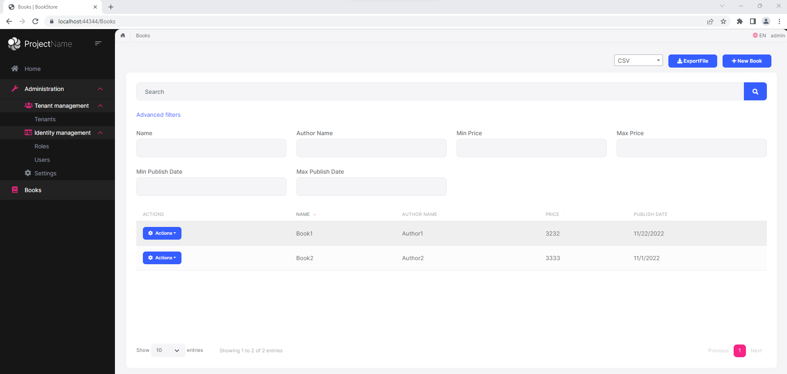
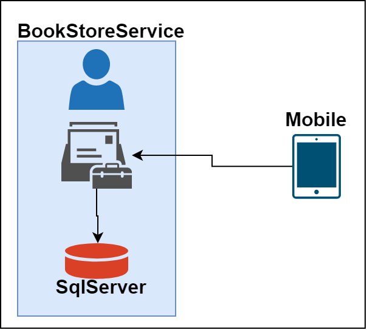
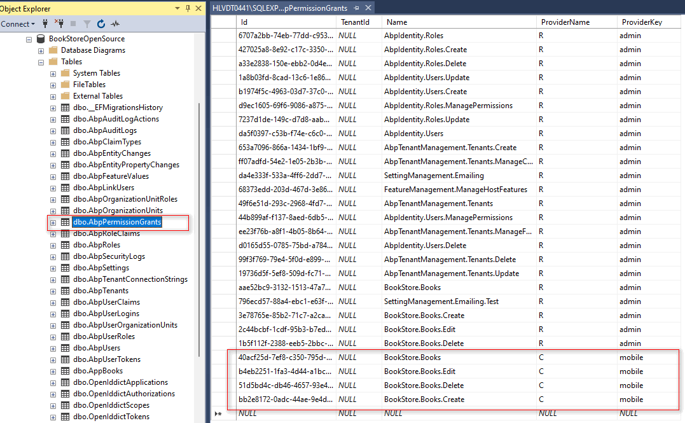
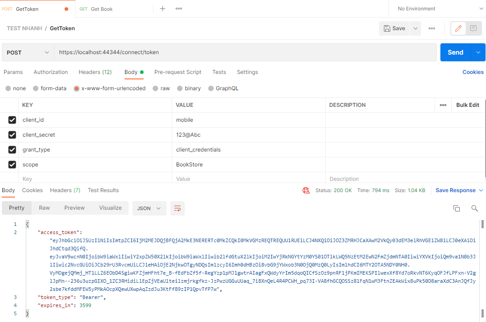
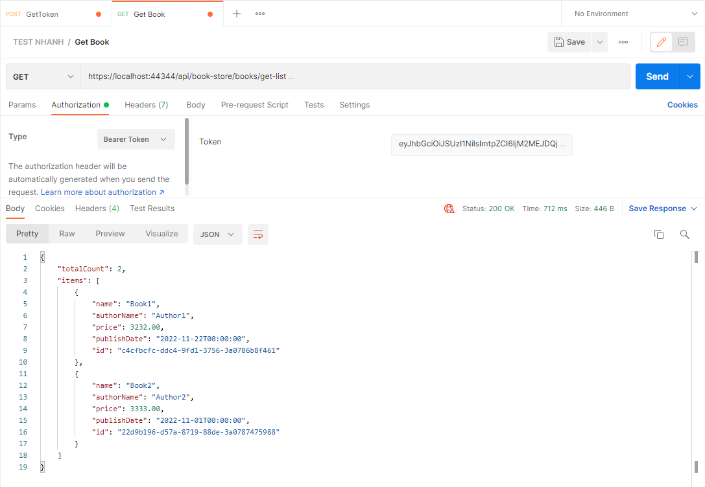

<a href="https://github.com/ngotruong09">
  <p align="center">
    
  </p>
</a>

## Tổng quan

Đây là project dạng non-layered Abp. Các tính năng có trong project gồm:
- [x] View, thêm, xóa, sửa book
- [x] Xuất file theo 2 định dạng CSV, EXCEL
- [x] Tạo thêm client để sử dụng cho phân hệ mobile
- [x] Cung cấp các api CRUD book cho phân hệ mobile   

Mô hình hệ thống

<p align="center">
  
</p>

### Các thành phần trong `BookStoreService`:

- Auth Server sử dụng `OpenIddict`
- Web Admin để quản lý Book
- Các Api dành cho mobile và admin
  - https://localhost:44344/swagger/index.html
- Database

## Cách chạy project

Set up sql server connection string tại appsettings.json

```bash
{
  ...
  "ConnectionStrings": {
    "Default": "Server=YourServer;Database=BookStoreDB;Trusted_Connection=True"
  },
  ...
}
```

Sau đó đứng tại thư mục `MyAbp.BookStore` chạy câu lệnh sau:

````bash
dotnet run --migrate-database
````

Bước tiếp theo, đứng tại thư mục `MyAbp.BookStore` chúng ta run câu lệnh:

````bash
abp install-libs
````

Câu lệnh trên sẽ pull các javascript package mà project sử dụng.

Sau khi câu lệnh trên chạy xong, chúng ta mở IDE Visual studio lên và chạy project.

## Gọi Api từ postman

Tạo Client từ Api `api/openid/app/create` với input:

````bash
{
  ClientId : "mobile",
  ClientSecret : "123@Abc",
  ConsentType : "Implicit",
  DisplayName : "mobile",
  Type : "confidential",
  ClientUri : null,
  LogoUri : null
}
````

Phân quyền cho client `mobile`

<p align="center">
  
</p>

Gọi api connect (theo OAUTH 2.0) để get access token:

<p align="center">
  
</p>

Gọi api get book sử dụng access token ở trên:

<p align="center">
  
</p>
