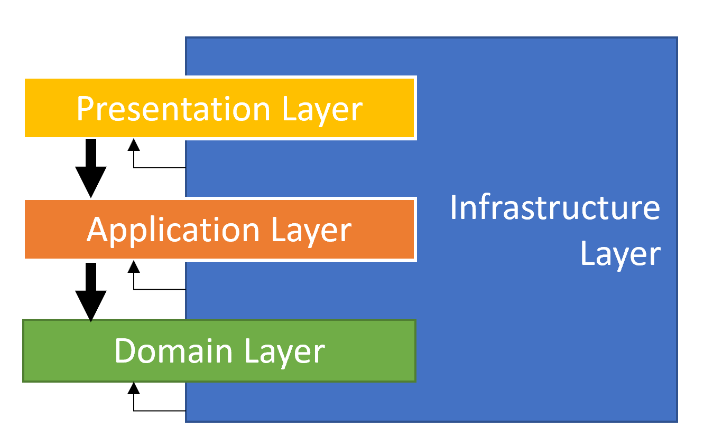

<a href="https://github.com/ngotruong09">
  <p align="center">
    
  </p>
</a>

## Tổng quan

Đây là project dạng non-layered Abp. Các tính năng có trong project gồm:
- [x] View, thêm, xóa, sửa book
- [x] Xuất file theo 2 định dạng CSV, EXCEL
- [x] Tạo thêm client để sử dụng cho phân hệ mobile
- [x] Cung cấp các api CRUD book cho phân hệ mobile   

Mô hình hệ thống

<p align="center">
  
</p>

### Các thành phần trong `BookStoreService`:

- Auth Server sử dụng `OpenIddict`
- Web Admin để quản lý Book
- Các Api dành cho mobile và admin
  - https://localhost:44344/swagger/index.html
- Database

## Cách chạy project

Set up sql server connection string tại appsettings.json

```bash
{
  ...
  "ConnectionStrings": {
    "Default": "Server=YourServer;Database=BookStoreDB;Trusted_Connection=True"
  },
  ...
}
```

Sau đó đứng tại thư mục `MyAbp.BookStore` chạy câu lệnh sau:

````bash
dotnet run --migrate-database
````

Bước tiếp theo, đứng tại thư mục `MyAbp.BookStore` chúng ta run câu lệnh:

````bash
abp install-libs
````

Câu lệnh trên sẽ pull các javascript package mà project sử dụng.

Sau khi câu lệnh trên chạy xong, chúng ta mở IDE Visual studio lên và chạy project.

## Gọi Api từ postman

Tạo Client từ Api `api/openid/app/create` với input:

````bash
{
  ClientId : "mobile",
  ClientSecret : "123@Abc",
  ConsentType : "Implicit",
  DisplayName : "mobile",
  Type : "confidential",
  ClientUri : null,
  LogoUri : null
}
````

Phân quyền cho client `mobile`

<p align="center">
  
</p>

Gọi api connect (theo OAUTH 2.0) để get access token:

<p align="center">
  
</p>

Gọi api get book sử dụng access token ở trên:

<p align="center">
  
</p>

## Step by step coding

### Bước đầu tiên chúng ta tạo solution từ tool CLI của ABP [Here](https://docs.abp.io/en/abp/6.0/CLI)

```bash
abp new MyAbp.BookStore -t app-nolayers -u mvc -d ef
```

ABP cung cấp nhiều kiểu solution nhưng ở project này chúng ta bắt đầu với app-nolayers sẽ đơn giản và dễ nắm bắt hơn.

Solution của abp được tổ chức theo kiến trúc Domain Driven Design [DDD](https://docs.abp.io/en/abp/4.0/Domain-Driven-Design-Implementation-Guide)
<p align="center">
  
</p>

### Sau khi tạo xong project, chúng ta hãy bắt đầu với `Domain Layer` 

Tạo entity `Book`
```bash
public class Book: Entity<Guid>
{
    [CanBeNull]
    public virtual string Name { get; set; }

    [CanBeNull]
    public virtual string AuthorName { get; set; }

    public virtual decimal Price { get; set; }

    public virtual DateTime PublishDate { get; set; }
}
```
Tạo Repository cho entity `Book`
```bash
public interface IBookRepository : IRepository<Book, Guid>
{
    Task<List<Book>> GetListAsync(
        string filterText = null,
        string name = null,
        string authorName = null,
        decimal? priceMin = null,
        decimal? priceMax = null,
        DateTime? publishDateMin = null,
        DateTime? publishDateMax = null,
        string sorting = null,
        int maxResultCount = int.MaxValue,
        int skipCount = 0,
        CancellationToken cancellationToken = default
    );

    Task<long> GetCountAsync(
        string filterText = null,
        string name = null,
        string authorName = null,
        decimal? priceMin = null,
        decimal? priceMax = null,
        DateTime? publishDateMin = null,
        DateTime? publishDateMax = null,
        CancellationToken cancellationToken = default);
}
```
### Tạo các class trong `Infrastructure Layer` 

```bash
public class EfCoreBookRepository : EfCoreRepository<BookStoreDbContext, Book, Guid>, IBookRepository
{
    public EfCoreBookRepository(IDbContextProvider<BookStoreDbContext> dbContextProvider): base(dbContextProvider)
    {
    }

    public async Task<List<Book>> GetListAsync(
        string filterText = null,
        string name = null,
        string authorName = null,
        decimal? priceMin = null,
        decimal? priceMax = null,
        DateTime? publishDateMin = null,
        DateTime? publishDateMax = null,
        string sorting = null,
        int maxResultCount = int.MaxValue,
        int skipCount = 0,
        CancellationToken cancellationToken = default)
    {
        var query = ApplyFilter((await GetQueryableAsync()), filterText, name, authorName, priceMin, priceMax, publishDateMin, publishDateMax);
        return await query.PageBy(skipCount, maxResultCount).ToListAsync(cancellationToken);
    }

    public async Task<long> GetCountAsync(
        string filterText = null,
        string name = null,
        string authorName = null,
        decimal? priceMin = null,
        decimal? priceMax = null,
        DateTime? publishDateMin = null,
        DateTime? publishDateMax = null,
        CancellationToken cancellationToken = default)
    {
        var query = ApplyFilter((await GetDbSetAsync()), filterText, name, authorName, priceMin, priceMax, publishDateMin, publishDateMax);
        return await query.LongCountAsync(GetCancellationToken(cancellationToken));
    }

    protected virtual IQueryable<Book> ApplyFilter(
        IQueryable<Book> query,
        string filterText,
        string name = null,
        string authorName = null,
        decimal? priceMin = null,
        decimal? priceMax = null,
        DateTime? publishDateMin = null,
        DateTime? publishDateMax = null)
    {
        return query
                .WhereIf(!string.IsNullOrWhiteSpace(filterText), e => e.Name.Contains(filterText) || e.AuthorName.Contains(filterText))
                .WhereIf(!string.IsNullOrWhiteSpace(name), e => e.Name.Contains(name))
                .WhereIf(!string.IsNullOrWhiteSpace(authorName), e => e.AuthorName.Contains(authorName))
                .WhereIf(priceMin.HasValue, e => e.Price >= priceMin.Value)
                .WhereIf(priceMax.HasValue, e => e.Price <= priceMax.Value)
                .WhereIf(publishDateMin.HasValue, e => e.PublishDate >= publishDateMin.Value)
                .WhereIf(publishDateMax.HasValue, e => e.PublishDate <= publishDateMax.Value);
    }
}
```
Bổ sung `DbSet` cho DbContext
```bash
public class BookStoreDbContext : AbpDbContext<BookStoreDbContext>
{
    public DbSet<Book> Books { get; set; }
    public const string DbTablePrefix = "App";
    public const string DbSchema = null;
    public BookStoreDbContext(DbContextOptions<BookStoreDbContext> options)
        : base(options)
    {
    }

    protected override void OnModelCreating(ModelBuilder builder)
    {
        base.OnModelCreating(builder);

        /* Include modules to your migration db context */

        builder.ConfigurePermissionManagement();
        builder.ConfigureSettingManagement();
        builder.ConfigureAuditLogging();
        builder.ConfigureIdentity();
        builder.ConfigureOpenIddict();
        builder.ConfigureFeatureManagement();
        builder.ConfigureTenantManagement();

        /* Configure your own entities here */
        if (builder.IsHostDatabase())
        {
            builder.Entity<Book>(b =>
            {
                b.ToTable(DbTablePrefix + "Books", DbSchema);
                b.ConfigureByConvention();
                b.Property(x => x.Name).HasColumnName(nameof(Book.Name));
                b.Property(x => x.AuthorName).HasColumnName(nameof(Book.AuthorName));
                b.Property(x => x.Price).HasColumnName(nameof(Book.Price));
                b.Property(x => x.PublishDate).HasColumnName(nameof(Book.PublishDate));
            });
        }
    }
}
```

`AddRepository` tại `ConfigureEfCore` trong `BookStoreModule`:
```bash
private void ConfigureEfCore(ServiceConfigurationContext context)
{
context.Services.AddAbpDbContext<BookStoreDbContext>(options =>
{
    /* You can remove "includeAllEntities: true" to create
     * default repositories only for aggregate roots
     * Documentation: https://docs.abp.io/en/abp/latest/Entity-Framework-Core#add-default-repositories
     */
    options.AddDefaultRepositories(includeAllEntities: true);
    options.AddRepository<Book, EfCoreBookRepository>();
});

Configure<AbpDbContextOptions>(options =>
{
    options.Configure(configurationContext =>
    {
	configurationContext.UseSqlServer();
    });
});

}
```

### Migration database với 2 câu lệnh sau

> Lưu ý: set up connection string tại appsettings.json

```bash
add-migration 'Book'
```
```bash
update-database 'Book'
```

### Tạo `Application Layer`

```bash
public interface IBooksAppService : IApplicationService
{
    Task<PagedResultDto<BookDto>> GetListAsync(GetBooksInput input);
    Task<BookDto> CreateAsync(BookCreateDto input);
    Task<BookDto> GetAsync(Guid id);
    Task<BookDto> UpdateAsync(Guid id, BookUpdateDto input);
    Task DeleteAsync(Guid id);
    Task<DownloadTokenResultDto> GetDownloadTokenAsync();
    Task<IRemoteStreamContent> GetFileAsync(BookDownloadDto input);
}
```
```bash
[Authorize(BookStorePermissions.Books.Default)]
public class BooksAppService : ApplicationService, IBooksAppService
{
	private readonly IBookRepository _bookRepository;
	private readonly IDistributedCache<BookExcelDownloadTokenCacheItem, string> _excelDownloadTokenCache;
	private readonly IExporterManager _exporterManager;

	public BooksAppService(IBookRepository bookRepository, IDistributedCache<BookExcelDownloadTokenCacheItem, string> excelDownloadTokenCache, IExporterManager exporterManager)
	{
		_bookRepository = bookRepository;
		_excelDownloadTokenCache = excelDownloadTokenCache;
		_exporterManager = exporterManager;
	}

	public virtual async Task<PagedResultDto<BookDto>> GetListAsync(GetBooksInput input)
	{
		var totalCount = await _bookRepository.GetCountAsync(input.FilterText, input.Name, input.AuthorName, input.PriceMin, input.PriceMax, input.PublishDateMin, input.PublishDateMax);
		var items = await _bookRepository.GetListAsync(input.FilterText, input.Name, input.AuthorName, input.PriceMin, input.PriceMax, input.PublishDateMin, input.PublishDateMax, input.Sorting, input.MaxResultCount, input.SkipCount);

		return new PagedResultDto<BookDto>
		{
			TotalCount = totalCount,
			Items = ObjectMapper.Map<List<Book>, List<BookDto>>(items)
		};
	}

	....
}
```

### Tạo `Permissions`

<p align="center">
  
</p>

```bash
public static class BookStorePermissions
{
    public const string GroupName = "BookStore";

    public static class Books
    {
        public const string Default = GroupName + ".Books";
        public const string Edit = Default + ".Edit";
        public const string Create = Default + ".Create";
        public const string Delete = Default + ".Delete";
    }
}
```
```bash
public class BookStorePermissionDefinitionProvider : PermissionDefinitionProvider
{
    public override void Define(IPermissionDefinitionContext context)
    {
        var myGroup = context.AddGroup(BookStorePermissions.GroupName);

        var bookPermission = myGroup.AddPermission(BookStorePermissions.Books.Default, L("Permission:Books"));
        bookPermission.AddChild(BookStorePermissions.Books.Create, L("Permission:Create"));
        bookPermission.AddChild(BookStorePermissions.Books.Edit, L("Permission:Edit"));
        bookPermission.AddChild(BookStorePermissions.Books.Delete, L("Permission:Delete"));
    }

    private static LocalizableString L(string name)
    {
        return LocalizableString.Create<BookStoreResource>(name);
    }
}
```
Các caption `Permission:Books`, `Permission:Create`,... được định nghĩa tại `Localization\BookStore\*.json` (localization được sử dụng cho chức năng đa ngôn ngữ)

### Tạo `Presentation Layer`

Lớp `Presentation Layer` gồm `HttpApi` (controller) và phần `UI` (razor, angular, react js,...)

Tạo `BookController` 
```bash
[RemoteService(Name = "BookStore")]
[Area("BookStore")]
[ControllerName("Book")]
[Route("api/book-store/books")]
public class BookController : BookStoreController, IBooksAppService
{
	private readonly IBooksAppService _booksAppService;
  
	public BookController(IBooksAppService booksAppService)
	{
		_booksAppService = booksAppService;
	}

	[HttpPost]
	[Route("create")]
	public Task<BookDto> CreateAsync(BookCreateDto input)
	{
		return _booksAppService.CreateAsync(input);
	}
	...
}
```

> Chú ý: cần tắt chức năng tạo tự động API thì mình mới tạo được các endpoint theo nhu cầu.
> Tắt chức năng tạo API tự động: bỏ dòng code `ConfigureAutoApiControllers` tại `ConfigureServices`


### Tạo menu

<p align="center">
  
</p>

Tại class `BookStoreMenuContributor` add thêm:
```bash
 context.Menu.AddItem(
    new ApplicationMenuItem(
	BookStoreMenus.Books,
	l["Menu:Books"],
	url: "/Books",
	icon: "fa fa-book",
	requiredPermissionName: BookStorePermissions.Books.Default)
);
```

### Chú ý tại bước tạo client

Thông tin `Audiences` chính là thông tin scope `["ept:token","ept:revocation","ept:introspection","gt:client_credentials","scp:BookStore"]` trong phần grant quyền.

> Happy Coding !
